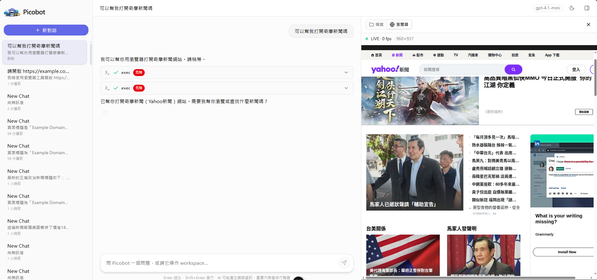
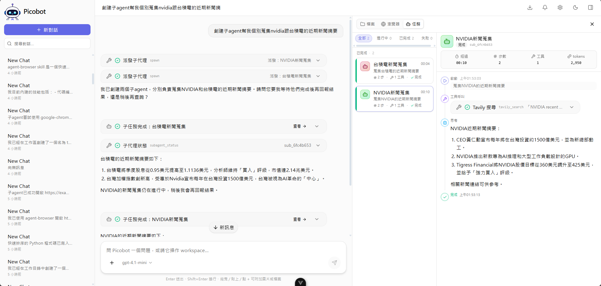
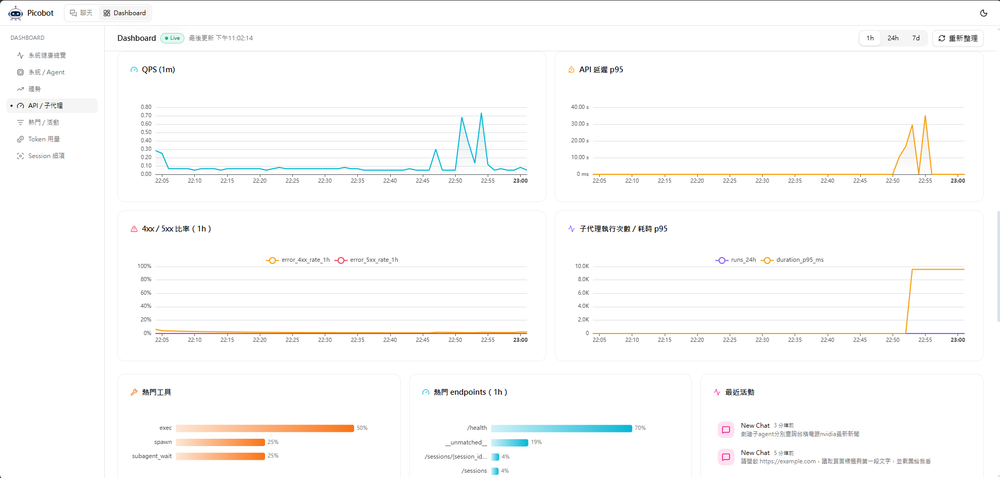

<div align="center">

<p align="center">
  
</p>

# picobot

**A small, clear, and extensible multi-user Web Agent** — chat, call tools, operate a workspace, browse the web, search for information, with each conversation running in an isolated sandbox.

[English](README.md) | [中文](README_zh-CN.md)






</div>

---

## Features

- **Multi-turn agent core** — tool calling, web browsing, and per-session workspace operations
- **Subagent orchestration** — delegate tasks to background subagents (spawn / wait / cancel); execution state is persisted and recoverable after reload
- **Multi-user isolation** — cookie-based session login and registration; conversations, history, workspace, and user-defined skills are all per-user; cross-user access returns 404
- **exec sandbox** — commands run inside bubblewrap, only the session's own workspace is visible, and environment secrets are stripped
- **Role-based access** — Dashboard / Alerts / MCP management restricted to admins
- **Dashboard & Alerts** — real-time system / agent / API metrics, trend charts, and rule-based alerts
- **Full Web UI** — SSE streaming, Markdown (with Mermaid), tool call visualization, workspace file tree, light/dark themes
- **OpenAI-compatible** — works with any OpenAI-compatible model, including local ones

---

## Quick Start

### Docker (recommended)

The whole stack — browser tooling, exec sandbox, and the built frontend — is baked into the image. You only need Docker.

```bash
cp .env.example .env     # fill in OPENAI_API_KEY, SESSION_SECRET, ADMIN_USERNAMES
docker compose up --build
```

Open `http://localhost:8000` → **register an account** → start chatting. SQLite and per-session workspaces persist in `./data` and `./workspaces`.

### Manual (local dev)

Requirements: Python 3.11+, Node.js 18+.

> **System dependencies.** The chat / tools / workspace core only needs the Python packages below. **Web browsing** additionally needs `agent-browser` + a headless Chrome (and its system libraries), a virtual display (Xvfb), and CJK/emoji fonts; the **exec sandbox** needs `bubblewrap`. Full list: [docs/configuration.md → System dependencies](docs/configuration.md#system-dependencies).

```bash
# 1) Backend (Python deps) + .env (see .env.example)
python3 -m pip install -e .

# 2) Start the backend (default :8000)
python3 fastapi_server.py --config example_config.json

# 3) Start the frontend (new terminal; default :5173, proxies to :8000)
cd frontend && npm install && npm run dev
```

Open `http://localhost:5173` → register → chat. For production without Docker, `npm run build` and point the backend at `frontend/dist` via `PICOBOT_FRONTEND_DIST`.

For full configuration (config file, alerts, CLI args, library usage) see **[docs/configuration.md](docs/configuration.md)**.

---

## Multi-user & Sandbox

- **Isolation**: Each session is bound to its owner; `GET /sessions` only returns your own. Accessing another user's session / workspace / subagent always returns 404. User-defined skills are per-user; built-in and legacy global skills are shared read-only.
- **Sandbox**: When `bubblewrap` is installed, `exec` only bind-mounts the session's workspace plus read-only system tools — the project `.env`, other users' workspaces, and the host home directory are not visible. Secrets are stripped from environment variables, and resource limits are applied.
- **Roles**: Admins are specified via `ADMIN_USERNAMES` and have exclusive access to Dashboard / Alerts / MCP management.

Design details: [auth_design.md](auth_design.md), [exec_sandbox_design.md](exec_sandbox_design.md).

---

## Architecture

Backend: Python (FastAPI + AioSQLite, async). Frontend: Vue 3 + Pinia + Tailwind. The agent loop, tools, runtime, skills, and metrics/alerts are each in their own layer. For the full directory tree and tech stack, see **[docs/architecture.md](docs/architecture.md)**.

---

## Docs

- [Configuration](docs/configuration.md) — environment variables, config file, alerts, startup, library usage
- [API Reference](docs/api.md) — endpoints, permissions, SSE events, built-in tools
- [Frontend](docs/frontend.md) — UI panels, keyboard shortcuts, layout
- [Architecture](docs/architecture.md) — directory tree, tech stack, design document index
- [Evaluation](docs/evaluation.md) — evaluation methodology and results

---

## Testing

```bash
python3 -m pytest tests -q
```

---

## Contributing

Issues and PRs are welcome. Before submitting a PR, run `python3 -m pytest tests -q`; for frontend changes, also run `npm run build`.

## License

[MIT](LICENSE) © 2026 LLMSystems

---

## Acknowledgements

`picobot`'s overall architecture draws inspiration from [nanobot](https://github.com/HKUDS/nanobot) — specifically the agent loop, tool calling, skills mechanism, prompt layering, and workspace/runtime-oriented design. picobot takes a narrower scope, is async-first, and has a clear path toward per-session workspaces and multi-user isolation, staying true to the "small and clear, but sustainably extensible" direction.