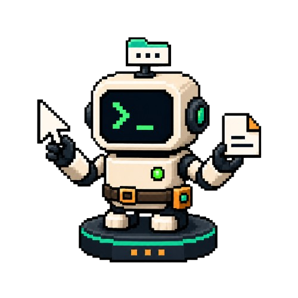
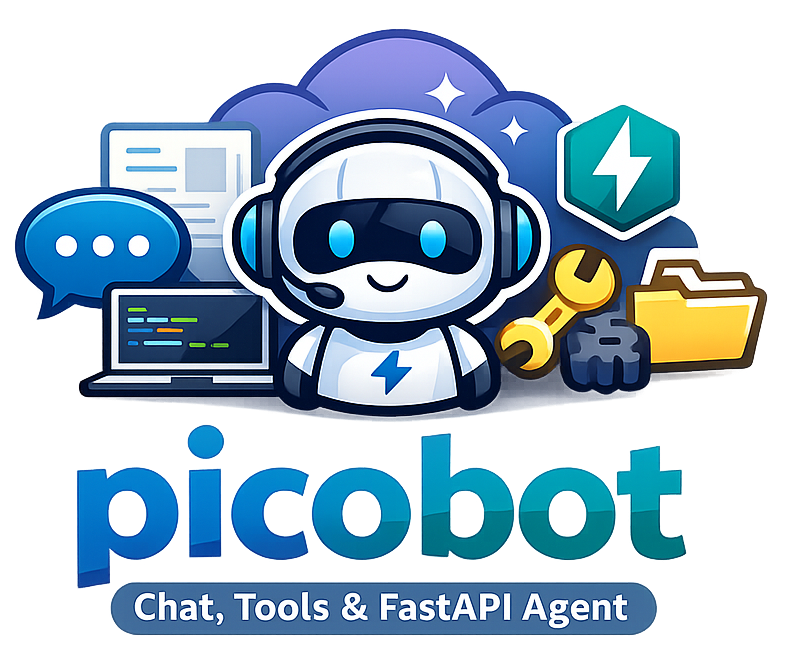

<div align="center">

<p align="center">
  
</p>

# picobot

**小而清楚、可擴展的多使用者 Web Agent** —— 聊天、調用工具、操作 workspace、瀏覽網頁、搜尋資料，每個對話跑在獨立的沙箱裡。

[English](README.md) | [中文](README_zh-CN.md)




</div>

---

## 功能特性

- **多輪 agent 核心** —— 可調用工具、可瀏覽網頁、可操作 per-session workspace
- **Subagent orchestration** —— 背景委派子代理（spawn / wait / cancel），執行狀態持久化、reload 後可恢復
- **多使用者隔離** —— cookie session 登入註冊；對話、歷史、workspace、自建 skills 皆 per-user，跨使用者一律 404
- **exec 沙箱** —— 指令在 bubblewrap 內執行，只看得到自己的 workspace，環境 secret 已剔除
- **角色控制** —— 營運 Dashboard / Alerts / MCP 管理僅限管理者
- **Dashboard 與 Alerts** —— 系統 / Agent / API 即時指標、趨勢圖、規則式告警
- **完整 Web UI** —— SSE 串流、Markdown（含 Mermaid）、工具呼叫視覺化、Workspace 檔案樹、深淺主題
- **OpenAI-compatible** —— 可接任何相容 OpenAI 介面的模型（含本地）

---

## 快速開始

### Docker（推薦）

整套環境 —— 瀏覽器工具、exec 沙箱、前端 build —— 都烤進 image，你只需要 Docker。

```bash
cp .env.example .env     # 填入 OPENAI_API_KEY、SESSION_SECRET、ADMIN_USERNAMES
docker compose up --build
```

開 `http://localhost:8000` → **註冊一個帳號** → 開始對話。SQLite 與各 session 的 workspace 會持久化在 `./data` 與 `./workspaces`。

### 手動（本機開發）

需求：Python 3.11+、Node.js 18+。

> **系統依賴。** 聊天 / 工具 / workspace 核心只需下面的 Python 套件。**網頁瀏覽**另需 `agent-browser` + 無頭 Chrome（及其系統庫）、虛擬顯示（Xvfb）、以及中日韓/emoji 字型；**exec 沙箱**需要 `bubblewrap`。完整清單見 [docs/configuration.md → System dependencies](docs/configuration.md#system-dependencies)。

```bash
# 1) 後端（Python 依賴）+ .env（見 .env.example）
python3 -m pip install -e .

# 2) 起後端（預設 :8000）
python3 fastapi_server.py --config example_config.json

# 3) 起前端（另開終端，預設 :5173，會代理到 :8000）
cd frontend && npm install && npm run dev
```

開 `http://localhost:5173` → 註冊 → 開始對話。不用 Docker 的正式部署：`npm run build` 後，用 `PICOBOT_FRONTEND_DIST` 讓後端 serve `frontend/dist`。

完整設定（設定檔、告警、CLI 參數、函式庫用法）見 **[docs/configuration.md](docs/configuration.md)**。

---

## 多使用者與沙箱

- **隔離**：每個 session 綁定 owner，`GET /sessions` 只回自己的；存取他人 session / workspace / subagent 一律回 404。自建 skills 為 per-user，builtin 與舊有全域 skills 共用唯讀。
- **沙箱**：裝了 `bubblewrap` 時，`exec` 只 bind-mount 該 session 的 workspace + 唯讀系統工具，看不到專案 `.env`、別人的 workspace 或主機家目錄；環境變數中的 secret 一律剔除，並有資源限額。
- **角色**：管理者由 `ADMIN_USERNAMES` 指定，獨享 Dashboard / Alerts / MCP 管理。

設計細節：[auth_design.md](auth_design.md)、[exec_sandbox_design.md](exec_sandbox_design.md)。

---

## 架構

後端 Python（FastAPI + AioSQLite，異步），前端 Vue 3 + Pinia + Tailwind。agent loop、工具、runtime、skills、metrics/alerts 各自分層。完整目錄樹與技術棧見 **[docs/architecture.md](docs/architecture.md)**。

---

## 文件

- [Configuration](docs/configuration.md) — 環境變數、設定檔、告警、啟動、函式庫用法
- [API Reference](docs/api.md) — 端點、權限、SSE 事件、內建工具
- [前端功能](docs/frontend.md) — UI 各面板、快捷鍵、版面
- [Architecture](docs/architecture.md) — 目錄樹、技術棧、設計文件索引
- [Evaluation](docs/evaluation.md) — 評測方法與結果

---

## 測試

```bash
python3 -m pytest tests -q
```

---

## 貢獻

歡迎 issue / PR。送 PR 前請先跑 `python3 -m pytest tests -q`，前端改動請跑 `npm run build`。

## 授權

[MIT](LICENSE) © 2026 LLMSystems

---

## 致謝

`picobot` 的整體架構參考了 [nanobot](https://github.com/HKUDS/nanobot)（agent loop、tool calling、skills 機制、prompt 分層、workspace/runtime 導向的設計）。picobot 走更小的開發範圍、以異步為核心、並有明確的 per-session workspace 與多使用者隔離路線，維持「小而清楚，但可持續擴展」的方向。